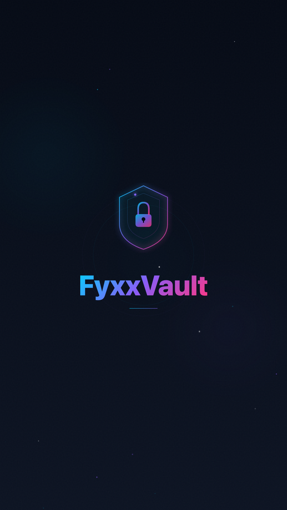

<p align="center">
  
</p>

<h1 align="center">FyxxVault</h1>

<p align="center">
  <strong>Self-hosted password manager with zero-knowledge encryption.</strong><br>
  Your data stays on your server. Always.
</p>

<p align="center">
  <a href="#quick-start"></a>
  <a href="LICENSE"></a>
  <a href="#security"></a>
  <a href="https://github.com/Fyxx20/FyxxVault/stargazers"></a>
</p>

<br>

<p align="center">
  
</p>

---

## Why FyxxVault?

Most password managers store your data on their servers, charge monthly fees, or require cloud accounts. FyxxVault is different:

- **100% self-hosted** — Your data never leaves your machine
- **Zero-knowledge** — AES-256-GCM encryption happens on your device, the server only stores encrypted blobs
- **Completely free** — No premium plan, no feature gates, no limits, forever
- **Open source** — Every line of code is auditable under GPL-3.0
- **No dependencies** — No Supabase, no AWS, no cloud. Just SQLite on your server

---

## Quick Start

### One-line install

```bash
curl -fsSL https://raw.githubusercontent.com/Fyxx20/FyxxVault/self-hosted/install.sh | bash
```

The animated installer will:
1. Check requirements (Node.js 18+, npm, git)
2. Download FyxxVault to `~/.fyxxvault/`
3. Install dependencies and build
4. Initialize the SQLite database
5. Set up the `fyxxvault` CLI command

Then start the server and open the management panel:

```bash
fyxxvault start          # Start the server
fyxxvault-panel          # Open the interactive panel
```

Open **http://localhost:3000** and create your account.

### Management Panel

Run `fyxxvault-panel` to open an interactive terminal dashboard with:
- **Live server status** — PID, uptime, port
- **Database stats** — size, users, entries, backups
- **One-key actions** — start/stop/restart, backup, integrity check, logs, security audit
- **Port configuration** — change port on the fly
- **Auto-update** — pull latest & rebuild

### Manual install

```bash
git clone -b self-hosted https://github.com/Fyxx20/FyxxVault.git
cd FyxxVault/web
npm install && npm run build
node build/index.js
```

### CLI Commands

```bash
fyxxvault start        # Start the server
fyxxvault stop         # Stop the server
fyxxvault status       # Check if running + DB size
fyxxvault backup       # Create database backup
fyxxvault check        # SQLite integrity check
fyxxvault audit        # File permissions audit
fyxxvault restart      # Restart the server
fyxxvault uninstall    # Uninstall instructions
```

---

## Features

| Feature | Status |
|---------|--------|
| Unlimited vault entries | :white_check_mark: |
| AES-256-GCM encryption | :white_check_mark: |
| PBKDF2-SHA256 (210K iterations) | :white_check_mark: |
| Password generator | :white_check_mark: |
| TOTP / 2FA codes | :white_check_mark: |
| Dark web monitoring (HIBP) | :white_check_mark: |
| Identity generator | :white_check_mark: |
| Secure sharing | :white_check_mark: |
| Chrome extension with autofill | :white_check_mark: |
| CSV import (Chrome, 1Password, Bitwarden, Samsung Pass) | :white_check_mark: |
| CSV / JSON export | :white_check_mark: |
| Emergency Kit PDF | :white_check_mark: |
| Admin panel (backup, logs, integrity) | :white_check_mark: |
| Auto-lock on inactivity | :white_check_mark: |

---

## Architecture

```
                    Your Device
┌─────────────────────────────────────────────┐
│                                             │
│   Browser / Extension                       │
│   ┌───────────────────────────────┐         │
│   │  AES-256-GCM encryption      │         │
│   │  PBKDF2-SHA256 key derivation │         │
│   │  VEK held in memory only      │         │
│   └──────────────┬────────────────┘         │
│                  │ encrypted blobs           │
│   ┌──────────────▼────────────────┐         │
│   │  SvelteKit + Node.js          │         │
│   │  REST API (localhost:3000)    │         │
│   └──────────────┬────────────────┘         │
│                  │                           │
│   ┌──────────────▼────────────────┐         │
│   │  SQLite (WAL mode)            │         │
│   │  ~/.fyxxvault/data/           │         │
│   │  Permissions: 0600            │         │
│   └───────────────────────────────┘         │
│                                             │
└─────────────────────────────────────────────┘
          Nothing leaves this box.
```

---

## Security

FyxxVault implements a **zero-knowledge architecture**:

1. Your **master password** derives a Key Encryption Key (KEK) via PBKDF2-SHA256 with **210,000 iterations**
2. A random **Vault Encryption Key (VEK)** is generated and wrapped with the KEK using AES-256-GCM
3. Each vault entry is **individually encrypted** with the VEK
4. Only encrypted blobs are stored in SQLite — the server **cannot read your data**
5. The VEK is held **in memory only** while your vault is unlocked — never written to disk
6. Login passwords are hashed server-side with PBKDF2-SHA256 (100K iterations, unique salt)

### Database Security

- SQLite in WAL mode for performance and crash safety
- File permissions set to `0600` (owner read/write only)
- Foreign keys enforced
- No network exposure — runs on localhost by default

> Found a vulnerability? Please read [SECURITY.md](SECURITY.md) for responsible disclosure.

---

## Tech Stack

| Component | Technology |
|-----------|------------|
| Web app | SvelteKit 5, Svelte 5, Tailwind CSS 4, TypeScript |
| Server | SvelteKit + adapter-node |
| Database | SQLite via better-sqlite3 (WAL mode) |
| Extension | Chrome MV3, TypeScript, Vite |
| Encryption | Web Crypto API (AES-256-GCM, PBKDF2-SHA256) |
| Auth | Cookie-based sessions, PBKDF2 password hashing |

---

## Project Structure

```
FyxxVault/
├── web/                        # SvelteKit web application
│   ├── src/
│   │   ├── lib/
│   │   │   ├── server/db.ts    # SQLite database module
│   │   │   ├── stores/         # Auth & vault state (Svelte 5 runes)
│   │   │   ├── emergencyKit.ts # PDF emergency kit generator
│   │   │   └── translations/   # i18n (fr/en)
│   │   └── routes/
│   │       ├── api/            # REST endpoints
│   │       │   ├── auth/       # Login
│   │       │   ├── vault/      # CRUD
│   │       │   ├── profile/    # Registration & profile
│   │       │   └── panel/      # Admin (status, backup, logs)
│   │       ├── vault/          # Main app pages
│   │       └── panel/          # Admin dashboard
│   └── build/                  # Production output (adapter-node)
├── extension/                  # Chrome browser extension (MV3)
├── self-hosted/
│   ├── bin/fyxxvault.js        # CLI tool
│   └── scripts/init-db.js     # Database initializer
└── SECURITY.md
```

---

## Comparison

| Feature | FyxxVault | 1Password | Bitwarden | LastPass |
|---------|:---------:|:---------:|:---------:|:--------:|
| Price | **Free** | $2.99/mo | $0-3/mo | $3/mo |
| Self-hosted | **Yes** | No | Yes | No |
| Open source | **Yes** | No | Partial | No |
| Zero-knowledge | **Yes** | Yes | Yes | No |
| No cloud required | **Yes** | No | No | No |
| Unlimited entries | **Yes** | Yes | Yes | Yes |
| TOTP / 2FA | **Yes** | Yes | Premium | Premium |
| Dark web monitoring | **Yes** | Premium | Premium | Premium |
| Identity generator | **Yes** | No | No | No |

---

## Configuration

Environment variables (optional):

| Variable | Default | Description |
|----------|---------|-------------|
| `PORT` | `3000` | Server port |
| `FYXXVAULT_DATA_DIR` | `~/.fyxxvault/data/` | Database location |

---

## Contributing

Contributions are welcome! Here's how:

1. Fork the repository
2. Create a feature branch (`git checkout -b feature/my-feature`)
3. Commit your changes
4. Push and open a Pull Request

Please make sure your code follows the existing patterns and doesn't introduce security vulnerabilities.

---

## License

FyxxVault is licensed under the [GNU General Public License v3.0](LICENSE).

You can use, modify, and distribute FyxxVault freely — any derivative work must also be open source under the same license.

---

<p align="center">
  <br>
  <strong>Your passwords. Your server. Your rules.</strong>
  <br><br>
  Built by <a href="https://github.com/Fyxx20">@Fyxx20</a><br>
  <sub>Because security should be a right, not a subscription.</sub>
</p>
